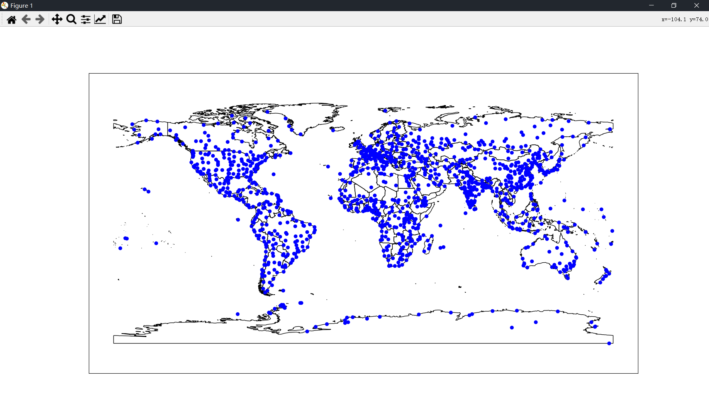
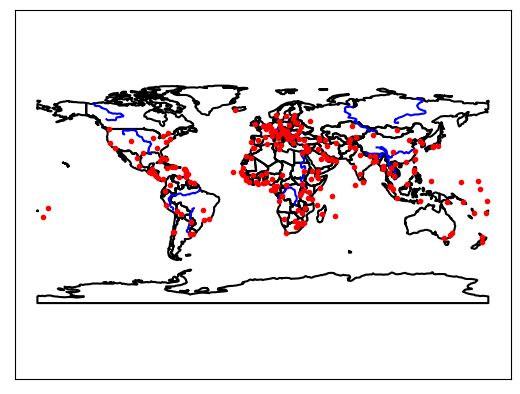

# Python-Geoprocessing-Note

Note for the book *[Geoprocessing with Python](Manning.Geoprocessing.with.Python.1617292141.pdf)*.


## Table of contents

- [Python-Geoprocessing-Note](#python-geoprocessing-note)
  - [Table of contents](#table-of-contents)
  - [1. Introduction](#1-introduction)
    - [1.1. Why use Python and open source?](#11-why-use-python-and-open-source)
    - [1.2. Types of spatial data](#12-types-of-spatial-data)
    - [1.3. What is geoprocessing?](#13-what-is-geoprocessing)
    - [1.4. Exploring your data](#14-exploring-your-data)
    - [1.5. Summary](#15-summary)
  - [2. Python basics](#2-python-basics)
  - [3. Reading and writing vector data](#3-reading-and-writing-vector-data)
    - [3.1. Introduction to vector data](#31-introduction-to-vector-data)
    - [3.2. Introduction to OGR](#32-introduction-to-ogr)
    - [3.3. Reading vector data](#33-reading-vector-data)
      - [3.3.1. Accessing specific features](#331-accessing-specific-features)
      - [3.3.2. Viewing your data](#332-viewing-your-data)
        - [3.3.2.1. VIEWING ATTRIBUTES](#3321-viewing-attributes)
        - [3.3.2.2. PLOTTING SPATIAL DATA](#3322-plotting-spatial-data)
    - [3.4. Getting metadata about the data](#34-getting-metadata-about-the-data)
    - [3.5. Writing vector data](#35-writing-vector-data)
      - [3.5.1. Creating new data source](#351-creating-new-data-source)
      - [3.5.2. Creating new fields](#352-creating-new-fields)
    - [3.6. Updating existing data](#36-updating-existing-data)
      - [3.6.1. Changing the layer definition](#361-changing-the-layer-definition)
      - [3.6.2. Adding, updating, and deleting features](#362-adding-updating-and-deleting-features)
    - [3.7. Summary](#37-summary)
  - [4. Working with different vector file formats](#4-working-with-different-vector-file-formats)
    - [4.1. Vector file formats](#41-vector-file-formats)
      - [4.1.1. File-based formats such as shapefile and geoJSON](#411-file-based-formats-such-as-shapefile-and-geojson)
      - [4.1.2. Multi-user database formats such as PostGIS](#412-multi-user-database-formats-such-as-postgis)
    - [4.2. Working with more data formats](#42-working-with-more-data-formats)
    - [4.3. Testing format capabilities](#43-testing-format-capabilities)
    - [4.4. Summary](#44-summary)
  - [5. Filtering data with OGR](#5-filtering-data-with-ogr)
  - [6. Manipulating geometries with OGR](#6-manipulating-geometries-with-ogr)
  - [7. Vector analysis with OGR](#7-vector-analysis-with-ogr)
  - [8. Using spatial reference systems](#8-using-spatial-reference-systems)
  - [9. Reading and writing raster data](#9-reading-and-writing-raster-data)
    - [9.1. Introduction to raster data](#91-introduction-to-raster-data)
    - [9.2. Introduction to GDAL](#92-introduction-to-gdal)
    - [9.3. Reading partial datasets](#93-reading-partial-datasets)
      - [9.3.1. Using real-world coordinates](#931-using-real-world-coordinates)
      - [9.3.2. Resampling data](#932-resampling-data)
    - [9.4. Byte sequences](#94-byte-sequences)
    - [9.5. Subdatasets](#95-subdatasets)
    - [9.6. Web map services](#96-web-map-services)
    - [9.7. Summary](#97-summary)
  - [10. Working with raster data](#10-working-with-raster-data)
  - [11.Map algebra with NumPy and SciPy](#11map-algebra-with-numpy-and-scipy)
  - [12. Map classification](#12-map-classification)
  - [13. Visualizing data](#13-visualizing-data)
    - [13.1. Matplotlib](#131-matplotlib)
      - [13.1.1. Plotting vector data](#1311-plotting-vector-data)
      - [13.1.2. Poltting raster data](#1312-poltting-raster-data)
      - [13.1.3. Plotting 3D data](#1313-plotting-3d-data)
    - [13.2. Mapnik](#132-mapnik)
    - [13.3. Summary](#133-summary)
  - [References](#references)

## 1. Introduction

After reading this book, you'll write Python scripts to solve basic data analysis problems and have the background knowledge to answer more-complicated questions.

### 1.1. Why use Python and open source?

First, Python is a powerful programming language that has the advantage of being much easier to learn than some other languages, and it's also easy to read. It's a good language to start with if you're never programmed before, and if you're coming from other languages, you'll probably find Python easy to pick up.

*Geospatial Data Abstraction Library* (GDAL) is an extremely popular C/C++ library for reading and writing spatial data, and bindings have been developed for Python, .NET, Ruby, and other languages. The GDAL library is even used by many proprietary software packages. Because of the library's widespread use, this book concentrates on GDAL/OGR.

### 1.2. Types of spatial data

You'll learn how to work with the two main types of spatial data, **vector** adn **raster**. Vector data is made up of points, lines and polygons, while raster data is a two or three dimensional array of data values such as the pixels in a photograph. A dataset containing country boundaries is an example of vector data. For example, the Portolan map of northwest Africa shown in figure 1.1.


Figure 1.1 A Portolan map of the northwest coast of Africa, circa 1590

Rasters, as the datasets are called, are two or three dimensional arrays of values, the way a photograph is a two-dimensional array of pixel values. In fact, aerial photographs such as the one shown in figure 1.5 are a commonly used type of raster data. Satellite images sometimes look similar, although they generally have lower resolutions. The cool thing about satellite imagery is that much of it is colleted using nonvisible light so it can provide information that a simple photograph cannot.


Figure 1.5 An aerial photograph near Seattle, Washington

Raster datasets are well suited to any **continuous** data, not only photographs but also precipitation data, temperature data, and *digital elevation model* (DEM), in which each pixel contains an elevation value.

### 1.3. What is geoprocessing?

Geoprocessing is a general term for manipulating spatial data, whether raster or vector.

### 1.4. Exploring your data

You'll see ways to visualize your data as you work with it in Python, but the best way to explore the dat is still to use a desktop GIS package. If you don't have access to GIS software already, QGIS is a good open source option. It's available from [www.qgis.org](www.qgis.org), and it runs on Linux, Mac OS X, and Windows.

> **Downloadable code and sample data**
>
> - Code: [https://github.com/cgarrard/osgeopy-code](https://github.com/cgarrard/osgeopy-code) and [https://www.manning.com/books/geoprocessing-with-python](https://www.manning.com/books/geoprocessing-with-python)
> - Data: [https://app.box.com/osgeopy](https://app.box.com/osgeopy) and [https://www.manning.com/books/geoprocessing-with-python](https://www.manning.com/books/geoprocessing-with-python)

### 1.5. Summary

- Python is a powerful multiplatform programming language that's relatively easy to learn.
- Free and open source software is not only free with regard to price (free beer), but also allows for many freedoms with how it's used (free speech).
- Many excellent open source Python modules exist for processing both vector and raster geospatial data.
- You don't give up quality by using open source tools. In fact several of these packages are also used by proprietary software.

## 2. Python basics

PASS.

## 3. Reading and writing vector data

These types of data, Where the geographic features are all distinct objects, are called *vector datasets*.

In this chapter you'll learn basic ideas behind vector data and how to use the OGR library to read, write, and edit these types of datasets.

### 3.1. Introduction to vector data

As its most basic, vector data are data in which geographic features are represented as discrete geometries——specifically, points, lines, and polygons. Geographic features that have distinct boundaries, such as cities , work well as vector data, but continuous data, such as elevation, don't.

**Shapefiles** are a popular format for storing vector data. A shapefile isn't made of a single file, however. In fact, this format requires a minimum of three binary files, each of which serves a different purpose. Geometry information is stored in .shp and .shx files, and attribute values are stored in a .dbf file. Additionally, other data, such as indexes or spatial reference information, can be stored in even more files. Generally you don't need to know anything about these files, but you do need to make sure that they're all kept together in the same folder.

Another widely used format, especially for web-mapping applications, is GeoJSON. These are plain text files that you can open up and look at in any text editor. Unlike a shapefile, a GeoJSON dataset consists of one file that stores all required information.

### 3.2. Introduction to OGR

The OGR Simple Feature Library is part of the Geospatial Data Abstraction Library (GDAL), an extremely popular open source library for reading and writing spatial data. The OGR portion of GDAL is the part that provides the ability to read and write many different vector data formats. OGR also allows you to create and manipulate geometries; edit attribute values; filter vector data based on attribute values or spatial location; and it also offers data analysis capabilities.

Before you start working with OGR, it's useful to look at how various objects in the OGR universe are related to each other, as shown in figure 3.6. Many vector data formats, such as the shapefile examples used in this chapter, can only contain one dataset. But others, such as SpatiaLite, can contain multiple datasets.


Figure 3.6 The OGR class structure. Each data source can have multiple layers, each layer can have multiple features, and each feature contains a geometry and one or more attributes.

Once you've imported `ogr`, then you can use `ogr.GetDriverByName` to find a specific driver.

```python
>>> from osgeo import ogr
>>> driver = ogr.GetDriverByName('geojson') 
>>> print(driver) 
<osgeo.ogr.Driver; proxy of <Swig Object of type 'OGRDriverShadow *' at 0x00000200C7FF0840> >
>>> driver = ogr.GetDriverByName('shapefile')
>>> print(driver) 
None # This does not work because the real name is 'Esri shapefile'.
>>> driver = ogr.GetDriverByName('esri shapefile')
>>> print(driver)
<osgeo.ogr.Driver; proxy of <Swig Object of type 'OGRDriverShadow *' at 0x00000201988D0840> >
```

### 3.3. Reading vector data

> [Listing 3.1 Printing data from the first ten features in a shapefile](code/3_1_read_vector_data.py)

<details>
<summary>View more</summary>

```python
# Script to read attribute from a shapefile
from osgeo import ogr  # Don't forget to import ogr


def read_vector_data(fn: str, num: int = 10):
    """Printing data from the first ten features in a shapefile.

    Args:
        fn (str): File name of the shapefile.
        num (int, optional): Number to printing features. Defaults to 10.
    """
    # Open the data source and get the layer
    ds = ogr.Open(fn)
    if ds is None:
        raise FileNotFoundError(f"[Errno 2] No such file or directory: '{fn}'")
    else:
        ly = ds.GetLayer(0)

    i = 0
    for ft in ly:
        # Get the x,y coordinates
        pt = ft.geometry()
        x = pt.GetX()
        y = pt.GetY()

        # Get the attribute values
        name = ft.GetField('Name')
        pop = ft.GetField('POP_MAX')
        print(name, pop, x, y)
        i += 1
        if i == num:
            break
        else:
            continue
    del ds


if __name__ == '__main__':
    read_vector_data('data/global/ne_50m_populated_places.shp')


"""Expected Output
Bombo 75000 32.533299524864844 0.5832991056146284
Fort Portal 42670 30.27500161597942 0.671004121125236       
Potenza 69060 15.798996495640267 40.642002130098206
Campobasso 50762 14.655996558921856 41.56299911864397       
Aosta 34062 7.315002595706176 45.7370010670723
Mariehamn 10682 19.949004471869102 60.09699618489543        
Ramallah 24599 35.206209378189556 31.90294475142406
Vatican City 832 12.453386544971766 41.903282179960115      
Poitier 85960 0.3332765285345545 46.58329225573658
Clermont-Ferrand 233050 3.080008095928406 45.779982115759424
"""
```

</details>

Remember that data sources are made of one or more layers that hold the data, so after opening the data source you need to get the layer from it. Data sources have a function called `GetLayer` that either a layer index or a layer name and returns the corresponding `Layer` object inside that particular data source. Layer indexes start at 0, so the first layer has index 0, the second has index 1, and so on. If you don't provide any parameters to `GetLayer`, then it returns the first layer in the data source. The shapefile only has one layer, so the index isn't technically needed in this case.

Now you want to get the data out of your layer. Recall that each layer is made of one or more features that you can iterate over with a loop, with each features representing a geographic object. The geometries and attribute values are attached to these features, so you need to look at them to get your data.

#### 3.3.1. Accessing specific features

Sometimes you don't need every feature, so you have no reason to iterate through all of them as you've done so far. One powerful method of limiting features to a subset is to select them by attribute value or spatial extent, and you'll do that in chapter 5.

Another way is to look at features with specific offsets, also called *feature IDs* (FIDs). The offset is the position that the feature is at in hte dataset, starting with zero. It depends entirely on the position of the feature in the file and hsa nothing to do with the sort order in memory.

If you know the offset of the feature you want, you can ask for that feature by FID: `GetFeature(FID)`.

You can also get the total number of features with `GetFeatureCount`, so you cloud grab the last feature in the layer like this:

```python
>>> from osgeo import ogr
>>> ds = ogr.Open('data/global/ne_50m_populated_places.shp') 
>>> ly = ds.GetLayer(0) 
>>> num_features = ly.GetFeatureCount()
>>> last_feature = ly.GetFeature(num_features - 1) 
>>> last_feature.NAME
'Hong Kong'
```

#### 3.3.2. Viewing your data

##### 3.3.2.1. VIEWING ATTRIBUTES

You can print out attribute values to your screen using the `print_attributes` function, which looks like this:

`print_attributes(lyr_or_fn, [n], [fields], [geom], [reset])`

- `lyr_or_fn` is either a layer object or the path ot a data source. If it's a data source, the first layer will be used.
- `n` is an optional number of records to print. The default is to print them all.
- `geom` is an optional Boolean flag indicating whether the geometry type is printed. The default is `True`.
- `reset` is an optional Boolean flag indicating whether the layer should be reset to the first record before printing. The default is `True`.

<details>
<summary>View more</summary>

```python
# Print name and population attributes.
from typing import List
from osgeo import ogr


def _get_layer(lyr_or_fn):
    """Get the datasource and layer from a filename."""
    if type(lyr_or_fn) is str:
        ds = ogr.Open(lyr_or_fn)
        if ds is None:
            raise OSError('Could not open {0}.'.format(lyr_or_fn))
        return ds.GetLayer(), ds
    else:
        return lyr_or_fn, None


def _get_atts(feature, fields, geom):
    """Get attribute values from a feature."""
    data = [feature.GetFID()]
    geometry = feature.geometry()
    if geom and geometry:
        data.append(_geom_str(geometry))
    values = feature.items()
    data += [values[field] for field in fields]
    return data


def _geom_str(geom):
    """Get a geometry string for printing attributes."""
    if geom.GetGeometryType() == ogr.wkbPoint:
        return 'POINT ({:.3f}, {:.3f})'.format(geom.GetX(), geom.GetY())
    else:
        return geom.GetGeometryName()


def view_attributes(lyr_or_fn: str, n: str = None, fields: List = None, geom: bool = True, reset: bool = True):
    """Print attribute values in a layer.

    Args:
        lyr_or_fn (str): OGR layer object or filename to datasource (will use 1st layer).
        n (str, optional): optional number of features to print. Default to all.
        fields (List, optional): optional list of case-sensitive field names to print. Default to all.
        geom (bool, optional): optional boolean flag denoting whether geometry type is printed. Default to True.
        reset (bool, optional): optional boolean flag denoting whether the layer should be reset to the first record before printing; default is True. Defaults to True.
    """
    lyr, ds = _get_layer(lyr_or_fn)
    if reset:
        lyr.ResetReading()

    n = n or lyr.GetFeatureCount()
    geom = geom and lyr.GetGeomType() != ogr.wkbNone
    fields = fields or [field.name for field in lyr.schema]
    data = [['FID'] + fields]
    if geom:
        data[0].insert(1, 'Geometry')
    feat = lyr.GetNextFeature()
    while feat and len(data) <= n:
        data.append(_get_atts(feat, fields, geom))
        feat = lyr.GetNextFeature()
    lens = map(lambda i: max(map(lambda j: len(str(j)), i)), zip(*data))
    format_str = ''.join(map(lambda x: '{{:<{}}}'.format(x + 4), lens))
    for row in data:
        try:
            print(format_str.format(*row))
        except UnicodeEncodeError:
            e = sys.stdout.encoding
            print(codecs.decode(format_str.format(*row).encode(e, 'replace'), e))
    print('{0} of {1} features'.format(
        min(n, lyr.GetFeatureCount()), lyr.GetFeatureCount()))
    if reset:
        lyr.ResetReading()


if __name__ == '__main__':
    view_attributes(
        lyr_or_fn='data/global/ne_50m_populated_places.shp',
        n=3,
        fields=['NAME', 'POP_MAX']
    )


"""Expected Output
FID    Geometry                  NAME           POP_MAX    
0      POINT (32.533, 0.583)     Bombo          75000      
1      POINT (30.275, 0.671)     Fort Portal    42670      
2      POINT (15.799, 40.642)    Potenza        69060      
3 of 1249 features
"""
```
</details>

##### 3.3.2.2. PLOTTING SPATIAL DATA

The ospybook module also contains convenience classes to help you visualize your data. To use these, you must have the matplotlib Python module installed.

`plot (self, geom_or_lyr, [symbol], [name], [kwargs])`

- `geom_or_lyr` is geometry, layer, or path to a data source. If a data source, the first layer will be drawn.
- `symbol` is an optional `pyplot` symbol to draw the geometries with.
- `name` is an optional name to assign to the data so it can be accessed later.
- `kwargs` are optional `pyplot` drawing parameters that are specified by keyword (you'll see the abbreviation `kwargs` used often for an indeterminate number of keyword arguments).

<details>
<summary>View more</summary>

```python
import matplotlib as mpl
import matplotlib.pyplot as plt
from matplotlib.path import Path
from matplotlib.patches import PathPatch
from osgeo import ogr
import numpy as np


try:
    numeric_types = (int, float, long)
except NameError:
    numeric_types = (int, float)


class SimpleVectorPlotter(object):
    """Plots vector data represented as lists of coordinates."""

    # _graphics = {}

    def __init__(self, interactive, ticks=False, figsize=None, limits=None):
        """Construct a new SimpleVectorPlotter.

        interactive - boolean flag denoting interactive mode
        ticks       - boolean flag denoting whether to show axis tickmarks
        figsize     - optional figure size
        limits      - optional geographic limits (x_min, x_max, y_min, y_max)
        """
        # if figsize:
        #     plt.figure(num=1, figsize=figsize)
        plt.figure(num=1, figsize=figsize)
        self.interactive = interactive
        self.ticks = ticks
        if interactive:
            plt.ion()
        else:
            plt.ioff()
        if limits is not None:
            self.set_limits(*limits)
        if not ticks:
            self.no_ticks()
        plt.axis('equal')
        self._graphics = {}
        self._init_colors()

    def adjust_markers(self):
        figsize = plt.gcf().get_size_inches()
        r = min(figsize[0] / 8, figsize[1] / 6)
        mpl.rcParams['lines.markersize'] = 6 * r
        mpl.rcParams['lines.markeredgewidth'] = 0.5 * r
        mpl.rcParams['lines.linewidth'] = r
        mpl.rcParams['patch.linewidth'] = r

    def adjust_markersize(self, size):
        figsize = plt.gcf().get_size_inches()
        r = min(figsize[0] / 8, figsize[1] / 6)
        return 6 * r


    def axis_on(self, on):
        """Turn the axes and labels on or off."""
        if on:
            plt.axis('on')
        else:
            plt.axis('off')

    def clear(self):
        """Clear the plot area."""
        plt.cla()
        self._graphics = {}
        if not self.ticks:
            self.no_ticks()

    def close(self):
        """Close the plot."""
        self.clear()
        plt.close()

    def draw(self):
        """Draw a non-interactive plot."""
        plt.show()

    def hide(self, name):
        """Hide the layer with the given name."""
        try:
            graphics = self._graphics[name]
            graphic_type = type(graphics[0])
            if graphic_type is mpl.lines.Line2D:
                for graphic in graphics:
                    plt.axes().lines.remove(graphic)
            elif graphic_type is mpl.patches.Polygon or graphic_type is mpl.patches.PathPatch:
                for graphic in graphics:
                    plt.axes().patches.remove(graphic)
            else:
                raise RuntimeError('{} not supported'.format(graphic_type))
        except (KeyError, ValueError):
            pass

    def plot_line(self, data, symbol='', name='', **kwargs):
        """Plot a line.

        data   - list of (x, y) tuples
        symbol - optional pyplot symbol to draw the line with
        name   - optional name to assign to layer so can access it later
        kwargs - optional pyplot drawing parameters
        """
        graphics = self._plot_line(data, symbol, **kwargs)
        self._set_graphics(graphics, name, symbol or kwargs)

    def plot_multiline(self, data, symbol='', name='', **kwargs):
        """Plot a multiline.

        data   - list of lines, each of which is a list of (x, y) tuples
        symbol - optional pyplot symbol to draw the lines with
        name   - optional name to assign to layer so can access it later
        kwargs - optional pyplot drawing parameters
        """
        has_symbol = symbol or kwargs
        symbol = symbol or self._line_symbol()
        graphics = self._plot_multiline(data, symbol, **kwargs)
        self._set_graphics(graphics, name, has_symbol)

    def plot_multipoint(self, data, symbol='', name='', **kwargs):
        """Plot a multipoint.

        data   - list of (x, y) tuples
        symbol - optional pyplot symbol to draw the points with
        name   - optional name to assign to layer so can access it later
        kwargs - optional pyplot drawing parameters
        """
        has_symbol = symbol or kwargs
        symbol = symbol or self._point_symbol()
        graphics = self._plot_multipoint(data, **kwargs)
        self._set_graphics(graphics, name, has_symbol)

    def plot_multipolygon(self, data, color='', name='', **kwargs):
        """Plot a multipolygon.

        data   - list of polygons, each of which is a list of rings, each of
                 which is a list of (x, y) tuples
        color  - optional pyplot color to draw the polygons with
        name   - optional name to assign to layer so can access it later
        kwargs - optional pyplot drawing parameters
        """
        has_symbol = bool(color or kwargs)
        if not ('facecolor' in kwargs or 'fc' in kwargs):
            kwargs['fc'] = color or self._next_color()
        graphics = self._plot_multipolygon(data, **kwargs)
        self._set_graphics(graphics, name, has_symbol)

    def plot_point(self, data, symbol='', name='', **kwargs):
        """Plot a point.

        data   - (x, y) tuple
        symbol - optional pyplot symbol to draw the point with
        name   - optional name to assign to layer so can access it later
        kwargs - optional pyplot drawing parameters
        """
        has_symbol = symbol or kwargs
        symbol = symbol or self._point_symbol()
        graphics = self._plot_point(data, symbol, **kwargs)
        self._set_graphics(graphics, name, has_symbol)

    def plot_polygon(self, data, color='', name='', **kwargs):
        """Plot a polygon.

        data   - list of rings, each of which is a list of (x, y) tuples
        color  - optional pyplot color to draw the polygon with
        name   - optional name to assign to layer so can access it later
        kwargs - optional pyplot drawing parameters
        """
        has_symbol = bool(color or kwargs)
        if not ('facecolor' in kwargs or 'fc' in kwargs):
            kwargs['fc'] = color or self._next_color()
        graphics = self._plot_polygon(data, **kwargs)
        self._set_graphics(graphics, name, has_symbol)

    def remove(self, name):
        """Remove a layer with the given name."""
        try:
            self.hide(name)
            del self._graphics[name]
        except KeyError:
            pass

    def save(self, fn, dpi=300):
        plt.savefig(fn, dpi=dpi, bbox_inches='tight', pad_inches=0.02)

    def set_limits(self, x_min, x_max, y_min, y_max):
        """Set geographic limits for plotting."""
        self.x_lim = x_min, x_max
        self.y_lim = y_min, y_max
        self._set_limits()

    def show(self, name):
        """Show the layer with the given name."""
        try:
            graphics = self._graphics[name]
            graphic_type = type(graphics[0])
            if graphic_type is mpl.lines.Line2D:
                for graphic in graphics:
                    plt.axes().add_line(graphic)
            elif graphic_type is mpl.patches.Polygon or graphic_type is mpl.patches.PathPatch:
                for graphic in graphics:
                    plt.axes().add_patch(graphic)
            else:
                raise RuntimeError('{} not supported'.format(graphic_type))
        except KeyError:
            pass

    def no_ticks(self):
        plt.gca().get_xaxis().set_ticks([])
        plt.gca().get_yaxis().set_ticks([])

    def zoom(self, factor):
        """Zoom in or out by a percentage; negative is out."""
        x_min, x_max, y_min, y_max = plt.axis()
        x_delta = (x_max - x_min) * factor / 100
        y_delta = (y_max - y_min) * factor / 100
        plt.axis((x_min + x_delta, x_max - x_delta,
                  y_min + y_delta, y_max - y_delta))

    def _clockwise(self, data):
        """Determine if points are in clockwise order."""
        total = 0
        x1, y1 = data[0]
        for x, y in data[1:]:
            total += (x - x1) * (y + y1)
            x1, y1 = x, y
        x, y = data[0]
        total += (x - x1) * (y + y1)
        return total > 0

    def _codes(self, data):
        """Get a list of codes for creating a new PathPatch."""
        codes = np.ones(len(data), dtype=np.int) * Path.LINETO
        codes[0] = Path.MOVETO
        return codes

    def _init_colors(self):
        if mpl.__version__ >= '1.5':
            self.colors = list(mpl.rcParams['axes.prop_cycle'])
            self.current_color = -1
            self._next_color = self._next_color_new
        else:
            self._next_color = self._next_color_old

    def _line_symbol(self):
        """Get a default line symbol."""
        return self._next_color() + '-'

    def _next_color_old(self):
        """Get the next color in the rotation."""
        return next(plt.gca()._get_lines.color_cycle)

    def _next_color_new(self):
        """Get the next color in the rotation."""
        self.current_color += 1
        if self.current_color >= len(self.colors):
            self.current_color = 0
        return self.colors[self.current_color]['color']

    def _order_vertices(self, data, clockwise=True):
        """Order vertices in clockwise or counter-clockwise order."""
        self._clockwise(data) != clockwise or data.reverse()
        if data[0] != data[-1]:
            data.append(data[0])
        return data

    def _plot_line(self, data, symbol, **kwargs):
        x, y = zip(*data)
        return plt.plot(x, y, symbol, **kwargs)

    def _plot_multiline(self, data, symbol, **kwargs):
        """Plot a multiline."""
        graphics = []
        for line in data:
            graphics += self._plot_line(line, symbol, **kwargs)
        return graphics

    def _plot_multipoint(self, data, symbol, **kwargs):
        """Plot a multipoint."""
        graphics = []
        for point in data:
            graphics += self._plot_point(point, symbol, **kwargs)
        return graphics

    def _plot_multipolygon(self, data, **kwargs):
        """Plot a multipolygon."""
        graphics = []
        for poly in data:
            graphics += self._plot_polygon(poly, **kwargs)
        return graphics

    def _plot_point(self, data, symbol, **kwargs):
        """Plot a point."""
        return plt.plot(data[0], data[1], symbol, **kwargs)

    def _plot_polygon(self, data, **kwargs):
        """Plot a polygon."""
        outer = self._order_vertices(data[0], True)
        inner = [self._order_vertices(d, False) for d in data[1:]]
        vertices = np.concatenate(
            [np.asarray(outer)] + [np.asarray(i) for i in inner])
        codes = np.concatenate(
            [self._codes(outer)] + [self._codes(i) for i in inner])
        patch = PathPatch(Path(vertices, codes), **kwargs)
        plt.axes().add_patch(patch)
        return [patch]

    def _point_symbol(self):
        """Get a default point symbol."""
        return self._next_color() + 'o'

    def _same_type(self, graphic1, graphic2):
        """Determine if two graphics are of the same type."""
        if type(graphic1) is not type(graphic2):
            return False
        if type(graphic1) is mpl.patches.Polygon: ## huh?
            return True
        if len(graphic1.get_xdata()) == len(graphic2.get_xdata()):
            return True
        return len(graphic1.get_xdata()) > 1 and len(graphic2.get_xdata()) > 1

    def _set_graphics(self, graphics, name, has_symbol):
        """Add graphics to plot."""
        name = name or len(self._graphics)
        if name in self._graphics:
            self.hide(name)
            if not has_symbol and self._same_type(graphics[0], self._graphics[name][0]):
                styled_graphic = self._graphics[name][0]
                for graphic in graphics:
                    graphic.update_from(styled_graphic)
        self._graphics[name] = graphics
        plt.axis('equal')

    def _set_limits(self):
        """Set axis limits."""
        plt.xlim(*self.x_lim)
        plt.ylim(*self.y_lim)
        plt.axes().set_aspect('equal')


point_types = [ogr.wkbPoint, ogr.wkbPoint25D,
               ogr.wkbMultiPoint, ogr.wkbMultiPoint25D]
line_types = [ogr.wkbLineString, ogr.wkbLineString25D,
              ogr.wkbMultiLineString, ogr.wkbMultiLineString25D]
polygon_types = [ogr.wkbPolygon, ogr.wkbPolygon25D,
                 ogr.wkbMultiPolygon, ogr.wkbMultiPolygon25D]


def _get_layer(lyr_or_fn):
    """Get the datasource and layer from a filename."""
    if type(lyr_or_fn) is str:
        ds = ogr.Open(lyr_or_fn)
        if ds is None:
            raise OSError('Could not open {0}.'.format(lyr_or_fn))
        return ds.GetLayer(), ds
    else:
        return lyr_or_fn, None


class VectorPlotter(SimpleVectorPlotter):
    """Plots vector data represented as OGR layers and geometries."""

    def __init__(self, interactive, ticks=False, figsize=None, limits=None):
        """Construct a new VectorPlotter.

        interactive - boolean flag denoting interactive mode
        ticks       - boolean flag denoting whether to show axis tickmarks
        figsize     - optional figure size
        limits      - optional geographic limits (x_min, x_max, y_min, y_max)
        """
        super(VectorPlotter, self).__init__(interactive, ticks, figsize, limits)

    def plot(self, geom_or_lyr, symbol='', name='', **kwargs):
        """Plot a geometry or layer.
        geom_or_lyr - geometry, layer, or filename
        symbol      - optional pyplot symbol to draw the geometries with
        name        - optional name to assign to layer so can access it later
        kwargs      - optional pyplot drawing parameters
        """
        if type(geom_or_lyr) is str:
            lyr, ds = _get_layer(geom_or_lyr)
            self.plot_layer(lyr, symbol, name, **kwargs)
        elif type(geom_or_lyr) is ogr.Geometry:
            self.plot_geom(geom_or_lyr, symbol, name, **kwargs)
        elif type(geom_or_lyr) is ogr.Layer:
            self.plot_layer(geom_or_lyr, symbol, name, **kwargs)
        else:
            raise RuntimeError('{} is not supported.'.format(type(geom_or_lyr)))

    def plot_geom(self, geom, symbol='', name='', **kwargs):
        """Plot a geometry.
        geom   - geometry
        symbol - optional pyplot symbol to draw the geometry with
        name   - optional name to assign to layer so can access it later
        kwargs - optional pyplot drawing parameters
        """
        geom_type = geom.GetGeometryType()
        if not symbol:
            if geom_type in point_types:
                symbol = self._point_symbol()
            elif geom_type in line_types:
                symbol = self._line_symbol()
        if geom_type in polygon_types and not self._kwargs_has_color(**kwargs):
            kwargs['fc'] = symbol or self._next_color()
        graphics = self._plot_geom(geom, symbol, **kwargs)
        self._set_graphics(graphics, name, symbol or kwargs)

    def plot_layer(self, lyr, symbol='', name='', **kwargs):
        """Plot a layer.
        geom   - layer
        symbol - optional pyplot symbol to draw the geometries with
        name   - optional name to assign to layer so can access it later
        kwargs - optional pyplot drawing parameters
        """
        geom_type = lyr.GetLayerDefn().GetGeomType()
        if geom_type == ogr.wkbUnknown:
            feat = lyr.GetFeature(0)
            geom_type = feat.geometry().GetGeometryType()
        if not symbol:
            if geom_type in point_types:
                symbol = self._point_symbol()
            elif geom_type in line_types:
                symbol = self._line_symbol()
        if geom_type in polygon_types and not self._kwargs_has_color(**kwargs):
            kwargs['fc'] = symbol or self._next_color()
        lyr.ResetReading()
        graphics = []
        for feat in lyr:
            graphics += self._plot_geom(feat.geometry(), symbol, **kwargs)
        self._set_graphics(graphics, name, symbol or kwargs)
        lyr.ResetReading()

    def _plot_geom(self, geom, symbol='', **kwargs):
        """Plot a geometry."""
        geom_name = geom.GetGeometryName()
        if geom_name == 'POINT':
            symbol = symbol or self._point_symbol()
            return self._plot_point(self._get_point_coords(geom), symbol, **kwargs)
        elif geom_name == 'MULTIPOINT':
            symbol = symbol or self._point_symbol()
            return self._plot_multipoint(self._get_multipoint_coords(geom), symbol, **kwargs)
        elif geom_name == 'LINESTRING':
            return self._plot_line(self._get_line_coords(geom), symbol, **kwargs)
        elif geom_name == 'MULTILINESTRING':
            return self._plot_multiline(self._get_multiline_coords(geom), symbol, **kwargs)
        elif geom_name == 'POLYGON':
            return self._plot_polygon(self._get_polygon_coords(geom), **kwargs)
        elif geom_name == 'MULTIPOLYGON':
            return self._plot_multipolygon(self._get_multipolygon_coords(geom), **kwargs)
        elif geom_name == 'GEOMETRYCOLLECTION':
            graphics = []
            for i in range(geom.GetGeometryCount()):
                graphics += self._plot_geom(geom.GetGeometryRef(i), symbol, **kwargs)
            return graphics
        else:
            raise RuntimeError('{} not supported'.format(geom_name))

    def _get_line_coords(self, geom):
        """Get line coordinates as a list of (x, y) tuples."""
        return [coords[:2] for coords in geom.GetPoints()]

    def _get_point_coords(self, geom):
        """Get point coordinates as an (x, y) tuple."""
        return (geom.GetX(), geom.GetY())

    def _get_polygon_coords(self, geom):
        """Get polygon coordinates as a list of lists of (x, y) tuples."""
        coords = []
        for i in range(geom.GetGeometryCount()):
            coords.append(self._get_line_coords(geom.GetGeometryRef(i)))
        return coords

    def _get_multiline_coords(self, geom):
        """Get multiline coordinates as a list of lists of (x, y) tuples."""
        coords = []
        for i in range(geom.GetGeometryCount()):
            coords.append(self._get_line_coords(geom.GetGeometryRef(i)))
        return coords

    def _get_multipoint_coords(self, geom):
        """Get multipoint coordinates as a list of (x, y) tuples."""
        coords = []
        for i in range(geom.GetGeometryCount()):
            coords.append(self._get_point_coords(geom.GetGeometryRef(i)))
        return coords

    def _get_multipolygon_coords(self, geom):
        """Get multipolygon coordinates as a list of lists rings."""
        coords = []
        for i in range(geom.GetGeometryCount()):
            coords.append(self._get_polygon_coords(geom.GetGeometryRef(i)))
        return coords

    def _kwargs_has_color(self, **kwargs):
        """Check if kwargs dictionary has a facecolor entry."""
        return 'fc' in kwargs or 'facecolor' in kwargs


if __name__=='__main__':
    vp = VectorPlotter(False)
    vp.plot('data/global/ne_50m_admin_0_countries.shp', fill=False)
    vp.plot('data/global/ne_50m_populated_places.shp', 'bo')
    vp.draw()
```
</details>



Figure 3.13 The output from plotting the global populated places shapefile on top of the country outlines

### 3.4. Getting metadata about the data

Sometimes you also need to know general information about a dataset, such as the number of features, spatial extent, geometry type, spatial reference system, or the names and types of attribute fields.

The spatial extent of a layer is the rectangle constructed form the manimum adn maximum bounding coordinates in all directions. Figure 3.14 shows the Washington large_cities file and its extent. You can get these bounding coordinates form a layer object with the `GetExtent` function, which returns a tuple of numbers as `(min_x, max_x, min_y, max_y)`. Here's an example:

```python
>>> from osgeo import ogr
>>> ds = ogr.Open('data/Washington/large_cities.geojson') 
>>> ly = ds.GetLayer(0) 
>>> extent = ly.GetExtent()
>>> print(extent) 
(-122.66148376464844, -117.4260482788086, 45.638729095458984, 48.759552001953125)
```


Figure 3.14 Here you can see the spatial extent of the `large_cities` dataset. The minimum and maximum longitude (x) values are approximately `-122.7` and `-117.4`, respectively. The minimum and maximum latitude (y) values are approximately `45.6` and `48.8`

You can also get the geometry type from the layer object, but there's a catch. The `GetGeomType` function returns an integer instead of a human-readable string. But how is that useful? The OGR module has a number of constants, shown in table 3.1, which are basically unchangeable variables with descriptive names and bumeric values. You can compare the calues you get with `GetGeomType` to one of these constants in order to check if it's that geometry type. For example, the constant for point geometries is `wkbPoint` and the one for polygons is `wkbPolygon`, so continuing with the previous example, you could find out if `large_cities.shp` is a point or polygon shapefile like this:

```python
>>> ly.GetGeomType()
1
>>> ly.GetGeomType() == ogr.wkbPoint  
True
>>> ly.GetGeomType() == ogr.wkbPolygon
False
```

Table 3.1 Common geometry type constatns. You can find more in appendix B

| Geometry type         | OGR constant       |
|-----------------------|--------------------|
| Point                 | wkbPoint           |  
| Mulitpoint            | wkbMultiPoint      |
| Line                  | wkbLineString      |
| Multiline             | wkbMultiLineString |
| Polygon               | wkbPolygon         |
| Multipolygon          | wkbMultiPolygon    |
| Unknown geometry type | wkbUnknown         |
| No geometry           | wkbNone            |

If the layer has geometries of varying types, such as a mixture of points and polygons, `GetGeomType` will return `wkbUnknown`.

> **NOTE** The wkb prefix on the OGR geometry constants stands for well-known binary (WKB), which is a standard binary representation used to exchange geometries between different software packages. Because it's binary, it isn't human-readable, but a well-known text (WKT) format does exist that is readable.

Sometimes you'd rather have a human-readable string, however, and you can get this from one of the feature geometries. The following example grabs the first feature in the layer, gets the geometry object from that feature, and then prints the name of the geometry:

```python
>>> ft = ly.GetFeature(0)
>>> ft.geometry().GetGeometryName()
'POINT'
```

Another useful piece of data you can get from the layer object is the spatial reference system, which describes the coordinate system that the dataset uses.

> Listing 3.2 Example of well-known text representation of a spatial reference system.

```python
>>> print(ly.GetSpatialRef())
GEOGCS["NAD83",
    DATUM["North_American_Datum_1983",
        SPHEROID["GRS 1980",6378137,298.257222101,
            AUTHORITY["EPSG","7019"]],
        AUTHORITY["EPSG","6269"]],
    PRIMEM["Greenwich",0,
        AUTHORITY["EPSG","8901"]],
    UNIT["degree",0.0174532925199433,
        AUTHORITY["EPSG","9122"]],
    AXIS["Latitude",NORTH],
    AXIS["Longitude",EAST],
    AUTHORITY["EPSG","4269"]]
```

Last, you can also get information about the attribute fields attached to the layer. The easiest way to do this is to use the `schema` property on the layer object to get a list of `FieldDefn` objects. Each of these contains information such as the attribute column name and data type. Here's an example of printing out the name and data type of each field:

```python
>>> from osgeo import ogr
>>> ds = ogr.Open('data/Washington/large_cities.geojson') 
>>> ly = ds.GetLayer(0) 
>>> for field in ly.schema:
...     print(field.name, field.GetTypeName())
... 
CITIESX020 Integer
FEATURE String    
NAME String       
POP_RANGE String  
POPULATION Integer
FIPS55 String     
COUNTY String     
FIPS String       
STATE String
STATE_FIPS String
DISPLAY Integer
```

### 3.5. Writing vector data

Reading data is definitely useful, but you'll probably need to edit existing or create new datasets. Listing 3.3 show how to create a new shapefile that contains only the features corresponding to capital cities in the global populated places shapefile. The output will look like the cities in figure 3.15.

> Listing 3.3 Exporting capital cities to a new shapefile

<details>
<summary>View more</summary>

```python
# Script to extract certain features from a shapefile and save them to another file.
import sys
from osgeo import ogr


def write_vector_data():
    # Open the folder data source for writing
    ds = ogr.Open('data/global', 1)  # 0: read only 1: read & write
    if ds is None:
        sys.exit('Could not open folder.')

    # Get the input shapefile
    in_lyr = ds.GetLayer('ne_50m_populated_places')

    # Create a point layer
    if ds.GetLayer('capital_cities'):
        ds.DeleteLayer('capital_cities')
    out_lyr = ds.CreateLayer(
        'capital_cities',
        in_lyr.GetSpatialRef(),
        ogr.wkbPoint
    )
    out_lyr.CreateFields(in_lyr.schema)

    # Create a blank feature
    out_defn = out_lyr.GetLayerDefn()
    out_feat = ogr.Feature(out_defn)

    for in_feat in in_lyr:
        if in_feat.GetField('FEATURECLA') == 'Admin-0 capital':
            # Copy geometry and attributes
            geom = in_feat.geometry()
            out_feat.SetGeometry(geom)
            for i in range(in_feat.GetFieldCount()):
                value = in_feat.GetField(i)
                out_feat.SetField(i, value)

            # Insert the feature
            out_lyr.CreateFeature(out_feat)

    # Close files
    del ds


if __name__ == '__main__':
    write_vector_data()
```
</details>


Figure 3.15 Capital cities with country outlines for reference

In this example you open up a folder instead of a shapefile as the data source. A nice feature of the shapefile driver is that it will treat a folder as a data source if a majority of the files in the folder are shapefiles, and each shapefile is treated as a layer. Notice that you pass `1` as the second parameter to `Open`, which will allow you to create a new layer (shapefile) in the folder. You pass the shapefile name, without the extension, to `GetLayer` to get the populated placed shapefile as a layer. Even though you open it differently here than in listing 3.1, you can use it in exactly the same way.

Because OGR won't overwrite existing layer, you check to see if the output layer already exists, and delete it if it did. Obviously you wouldn't want to do this if you didn't want the layer overwritten, but in this case you can overwrite data as you test different things.

Then you can create a new layer to store your output data in. The only required parameter for `CreateLayer` is a number for the layer, which should be unique within the data source. You do have, however, several optioanal parameters that you should set when possible:

`CreateLayer (name, [srs], [geom_type], [options])

- `name` is the name of the layer to create.
- `srs` is the spatial reference system that the layer will use. The default is None, meaning that no spatial reference system will be assigned.
- `geom_type` is a geometry type constant from table 3.1 that specifies the type of geometry the layer will hold. The default is wkbUnknown.
- `options` is an optional list of layer-creation options, which only applies to certain vector format types.

Now, to add a feature to a layer, you need to create a dummy feature that you add the geometry and attributes to, and then you insert that into the layer. The next step is to create this blank feature. Creating a feature requires a feature definiton that contains information about the geometry type and all of the attribute fields, and this is used to create an empty feature with the same fields and geometry type. You need to get the feature definition from the layer you plan to add features to, but you must do it after you've added, deleted, or updataed any fields.

Now that you have a feature to put information inot, it's time to start looping through the input dataset. For each feature, you check to see if its `FEATURECLA` attribute was equal to `Admin-0 capital`, which means it's a capital city. If it is, then you copy the geometry from it into the dummy feature. Then you loop through all of the fields in the attribute table and copy the values from the input feature into the output feature.

once you copy all of the attribute fields over, you insert the feature into the layer using `CreateFeature`. This function saves a copy of the feature, including all of the information you add to it, to the layer. The feature object can then be resused, and whatever you do to it won't affect the data that have already been added to the layer. This way you don't have the overhead of creating multiple features, because you can create a single one and keep editing its data each time you want to add a new feature to the layer.

You delete the `ds` variable at the end of the script, which forces the files to close and all of your edits to be written to disk. Deleting the layer variable doesn't do the trick; you must close the data source.

It's always a good idea to carefully inspect your output to make sure you get the results you want. The best way would be to open it in QGIS, or you could get a good idea by plotting it from Python.

#### 3.5.1. Creating new data source

You used an existing data soruce in listing 3.3, but sometimes you'll need to create new ones. Fortunately, it's not difficult. Perhaps the most important part is that you use the correct driver. It's the driver that does the work here, and each driver only knows how to work with one vector format, so using the correct one is essential.

You have a couple of ways to get the required driver. The first is to get the driver from a dataset that you've already opened, which will allow you to create a new data source using the same vector data format as the existing data source. In this example, the `driver` variable will hold the ESRI shapefile driver:

```python
>>> from osgeo import ogr
>>> ds = ogr.Open('data/global/ne_50m_admin_0_countries.shp') 
>>> ds.GetDriver()
<osgeo.ogr.Driver; proxy of <Swig Object of type 'OGRDriverShadow *' at 0x0000024648983E70> >
```

The second way to get the driver object is to use the OGR function `GetDriverByName` and pass it the short name of the driver. Remember that these names are available on the OGR website, by using the `ogrinfo` utility that comes with GDAL/OGR, or the `print_drivers` function available in the code accompanying this book. This example will get the GeoJSON driver:

```python
>>> from osgeo import ogr
>>> json_driver = ogr.GetDriverByName('GeoJSON')
```

Once you have a driver object, you can ust it to create an empty data source by providing the data source name. This new data source is automatically open for writing, and you can add layers to it the way you did in listing 3.3. If the data source can't be created, then `CreateDataSource` returns `None`, so you need to check for this conditon:

```python
json_ds = json_driver.CreateDataSource(json_fn)
if json_ds is None:
    sys.exit('Could not create {0}'.format(json_fn))
```

#### 3.5.2. Creating new fields

To add a field to a layer, you need a `FieldDefn` object that contains the important information about the field, such as name, data type, width, and precision. The `shema` property you used in listing 3.3 returns a list of these, one of each field in the layer. You can create you own, however, by providing the name and data type for the new field to the `FieldDefn` construntor. The data type is one of the constants from table 3.2.

Table 3.2 Field type constants. There are more shown in appendix B, but I have been ubable to make them work in Python.

|Field data type               | OGR constant
|------------------------------|---------------|
|Integer                       | OFTInteger    |
|List of integers              | OFTIntegerList|
|Floating point number         | OFTReal       |
|List of floating point numbers| OFTRealList   |
|String                        | OFTString     |
|List of strings               | OFTStringList |
|Date                          | OFTDate       |
|Time of day                   | OFTTime       |
|Date and time                 | OFTDateTime   |

After you create a basic field definiton, but before you use it to add a field to the layer, you can add other constrains such as floating-point precision or field with, although I've noticed that these don't always have an effect, depending on the driver being used. For example, I haven't been able to set a precision in a GeoJSON file, and I've also discoverd that you must set a field width if you want to set field precision in a shapefile. This example would create two fields to hold x and y coordinates with a precision of 3:

```python
coord_fld = ogr.FieldDefn('X', ogr.OFTReal)
coord_fld.SetWidth(8)
coord_fld.SetPrecision(3)
out_lyr.CreateField(coord_fld)
coord_fld.SetName('Y')
out_lyr.CreateField(coord_fld)
```

### 3.6. Updating existing data

Sometimes you need to update existing data rather than create an entirely new dataset. Whether this is possible, and which edits are supported, depends on the format of the data. For example, you can't edit GeoJSON files, but many different edits are allowed on shapefiles.

#### 3.6.1. Changing the layer definition

Depending on the type of data you're working with, you can edit the layer definition by adding new fields, deleting existing ones, or changing field properties such as name. As with adding new fields, you need a field definition to change a field. Once you have a field definition that you're happy with, you use the `AlterFieldDefn` function to replace the esisting field with the new one:

`AlterFieldDefn (iField, field_def, nFlags)`

- `iFiled` is the index of the field you want to change. A field name won't work in this case.
- `field_def` is the new field definition object.
- `nFlags` is an integer that is the sum of one or more of the constants shown in table 3.3.

Table 3.3 Flags used to specify which properties of a field definition can be changed. To use more than one, simply add them together

|Field properties that need to change|OGR constant              |
|------------------------------------|--------------------------|
|Field name only                     |ALTER_NAME_FLAG           |
|Field type only                     |ALTER_TYPE_FLAG           |
|Field width and/or precision only   |ALTER_WIDTH_PRECISION_FLAG|
|All of the above                    |ALTER_ALL_FLAG            |

To change a field's properties, you need to create a field definitoon containing the new properties, find the index of the existing field, and decide which constants from table 3.3 to use to ensure your changes take effect. To change the name of a field from `Name` to `City_Name`, you might do somethins like this:

```python
i = lyr.GetLayerDefn().GetFieldIndex('Name')
fld_defn = ogr.FieldDefn('City_Name', ogr.OFTString)
lyr.AlterFieldDefn(i, fld_defn, ogr.ALTER_NAME_FLAG)
```

If you needed to change multiple properties, such as both the name and the precision of a floating-point attribute field, you’d pass the sum of `ALTER_NAME_FLAG` and `ALTER_WIDTH_PRECISION_FLAG`, like this:

```python
lyr_defn = lyr.GetLayerDefn()
i = lyr_defn.GetFieldIndex('X')
width = lyr_defn.GetFieldDefn(i).GetWidth()
fld_defn = ogr.FieldDefn('X_coord', ogr.OFTReal)
fld_defn.SetWidth(width)
fld_defn.SetPrecision(4)
flag = ogr.ALTER_NAME_FLAG + ogr.ALTER_WIDTH_PRECISION_FLAG
lyr.AlterFieldDefn(i, fld_defn, flag)
```

#### 3.6.2. Adding, updating, and deleting features

Adding new features to existing layers is exactly the same as adding them to brand new layers. Create an empty feature based on the layer definition, populate it, and insert it into the layer. Updating features is much the same, except you work with features that already exist in the layer instead of blank ones. Find the feature you want to edit, make the desired changes, and then update the information in the layer by passing the updated feature to `SetFeature` instead of `CreateFeature`. For example, you cloud do something like this to add a unique ID value to each featurein a layer:

```python
lyr.CreateField(ogr.FieldDefn('ID', ogr.OFTInteger))
n = 1
for feat in lyr:
    feat.SetField('ID', n)
    lyr.SetFeature(feat)
    n += 1
```

First you add an ID field, and then you iterate through the features and set the ID equal to the value of the `n` variable. Because you increment `n` each time through the loop, each feature has a unique ID vlues. Last you update the feature in the layer by passing it to `SetFeature`.

Deleting features is even easier. All you need to know is the FID of the feature you want to get rid of. If you don't know that number off the top of your head, or through another means, you can get it from the feature itself, like this:

```python
lyr.CreateField(ogr.FieldDefn('ID', ogr.OFTInteger))
for feat in lyr:
    if feat.GetField('City_Name') == 'Seattle':
    lyr.DeleteFeature(feat.GetFID())
```

How to go about reclaiming this space, or determining if it needs to be done, is dependent on the vector data format being used. Here are examples for doing it for shapefiles and SQLite:

```python
ds.ExecuteSQL('REPACK ' + lyr.GetName()) # Shapefile
ds.ExecuteSQL('VACUUM')                  # SQLite
```

### 3.7. Summary

- Vector data formats are most appropriate for features that be characterized as a point, line, or polygon.
- Each geographic feature in a vector dataset can have attribute data, such as name or population, attached to it.
- The type of geometry used to model a given feature many change depending on scale. A city could be represented as a point on a map of an entire country, but as a polygon on a map of a smaller area, such as a country.
- Vector datasets excelfor measuring relationships between geographic features such as distances or overlaps.
- You can use OGR to read and write many different types of vector data, but which ones depend on which drivers have been complied into your version of GDAL/OGR.
- Data sources can contain one or more layers (depending on data format), and in turn,layers can contain one or more features. Each feature has a geometry and a variable number of attribute fields.
- Newly created data sources are automatically opened for writing. If you want to edit existing data, remember to open the data source for writing.
- Remember to make changes to the layer, such as adding or deleting fields, before getting the layer definiton and creating a feature for adding or updating data.

## 4. Working with different vector file formats

As mentioned in the previous chapter, there are many different vector file formats, and they're not always interchangebale, at least in a practical sense. Certain formats are more appropriate for certain uses than others. In this chapter you'll learn several of the differences and their strengths and weaknesses. You'll also learn how to determine what you can and can't do with a dataset.

### 4.1. Vector file formats

Up to this point, you've only worked with shapefiles, but many more vecotr file formats are available. Chances are that you'll  probably only use a handful of them on a regular basis, but you need to have an idea of the available options.

#### 4.1.1. File-based formats such as shapefile and geoJSON

What I call *file-based* formats are made up of one or more files that live on a disk driver and can be easily transferred from one location to another, such as from your hard driver to another computer or an external drive. Several of these formats have open standards so anyone can create software to use them, which others are proprietary and limited to smaller numbers of software. Examples of open formats are GeoJson, KML, GML, shapefile, and SpatiaLite.

Listing 4.1 shows an example of a GeoJSON file that contains two cities in Switzerland, Geneva and Lausanne, both represented as points.

> Listing 4.1 An example GeoJSON file with two features

```json
{
  "type": "FeatureCollection",
  "features": [
    { 
      "type": "Feature", 
      "properties": { "NAME": "Geneva", "PLACE": "city" }, 
      "geometry": { 
        "type": "Point", 
        "coordinates": [ 6.1465886, 46.2017589 ] 
      }
    },
    { 
      "type": "Feature", 
      "properties": { "NAME": "Lausanne", "PLACE": "city" }, 
      "geometry": { 
        "type": "Point", 
        "coordinates": [ 6.6327025, 46.5218269 ] 
      } 
    }
  ]
}
```

While we're on the subject, it's worth mentioning that small GeoJSON files are automatically rendered as interactive maps when uploaded to GitHub. The following is the example:

> [https://gist.github.com/XavierJiezou/34a3beb55258bd739ba2df771bec9d52](https://gist.github.com/XavierJiezou/34a3beb55258bd739ba2df771bec9d52)


Figure 4.1 Shows an example of a GeoJSON file rendered in [gist.github.com](https://gist.github.com/)

#### 4.1.2. Multi-user database formats such as PostGIS

Not only does [PostGIS](www.postgis.net) store the data, but you can use it for many types fo analyses as well, without the need for other GIS software. PostGIS also works with raster data.

### 4.2. Working with more data formats

PASS.

### 4.3. Testing format capabilities

PASS.

### 4.4. Summary

PASS.

## 5. Filtering data with OGR

## 6. Manipulating geometries with OGR

PASS.

## 7. Vector analysis with OGR

## 8. Using spatial reference systems

PASS.

## 9. Reading and writing raster data

If you have a geographic dataset that's made of continuous data such as elevation or temperature, it's probably a raster dataset. Spectral data such as aerial photographs and satellite imagery are also stroed this way. These types of datasets don't assume strict boundaries exist between objects in the way that vector datasets do.

Working with raster datasets is different from working with vectors. Instead of having individual geometries, you have a collection of pixels which is essentially a large two or three dimensional array of numbers. A raster dataset is made of bands instead of layers, and each of these bands is a two dimensional array. The collections of bands becomes a 3D array. It's a different way of thinking about spatial data.

In this chapter you'll learn basic theory of raster data, including tips for keeping them to manageable sizes. Then you'll see howt to use Python and GDAL to read these datasets into memory and how to write them back out to disk. The easiest case is to read and write an entire dataset at once, but sometimes you don't need the entire spatial extent, and other times the amount of memory is a limiting factors, so you'll also learn to deal with a spatial subset of the data. It's also possiable to change the pixel size while reading or writing, and you'll see how to do that as well.

### 9.1. Introduction to raster data

Objects that can be thought of as points, lines, or polygons are usually better left as vectors. Raster is a perfect choice when values change continuously instead of at sharply defined boundaries.

Sometimes you need what would normally be vector data to be represented as a raster. Also, raster datasets don't have to contain continuous data. In fact, I see many rasters made of categorical data such as land cover type. One reason for this is that rasters are used in the models used to produce these datasets in the first place. For example, land cover models typically use visible and nonvisible wavelengths of light from satellite imagery, along with ancillary data such as elevation. The model output is a raster because the inputs are rasters, and it makes sense to leave it that way. It also makes the data easy to use as an input to other raster-based models.

Now let's talk a bit about the details of raster datasets. You can probably envision a digital photograph as a two dimensional array of pixels. In fact, that's what we talk about when discussing the dimensions of a photo——the number of rows and columns in that 2D array. This is what raster datasets are, except that they aren't limited to two dimensions. They can have a third dimension in the form of bands. Digital photos have multiple bands, too, although you don't usually think of them that way. But they have one each for red, greem, and blue wavelengths of light. Your computer (or printer) combines these together to produce the colors you see on your monitor screen. You're familiar with this concept if you're ever created a webpage and specified a color using HEX notation, where the first two numbers correspond to red, the second two to green, and the last two to blue, or RGB notation where you provide a separate number for each of these colors.

Obviously not all raster datasets are photographs, so pixel values don't have to correspond to colors. Pixel values in a digital elevation model (DEM), for example, correspond to elevation values. Generally DEM datasets only contain one band, because elevation is the only value required to create a useful dataset.

Satellite imagery, on the other band, contains measurements of various wavelengths, many of which aren't visible to our eyes. While the image might contain bands corresponding to visible red, green, and blue wavelengths, there might also be bands for infrared of thermal radiaton. False color images such as those shown in figure 9.2 are created by displaying an infrared band along with visible light. The figure illustrates another use case for satellite imagery in the form of raster data. The image on the left was created using visible light wavelengths, like a traditional photograph. The camera also captured a near infrared wavelength as another band as the same time, and ti was used along with the visible red and green bands to create the false color image on the right. The near infrared band is brighter for growing vegetation, and it's displayed as red, so red areas are vegetation. This band combination is useful for monitoring vegetaion. The filed in the stadium and the practice fileds outside are both green and look like grass in the natural color image, but the field inside the stadium is dark gray in the false color image, so it must be artificial. The practice fields outside the stadium are bright red, so they must be grass.


Figure 9.2 Two Images of Gillette Stadium, home of the New England Patriots, in Foxborough, Massachusetts. The filed inside the stadium look like grass in the natural color image on the left, and it looks gray in the false color image on the right, which makes it clear that it's acturally artificial. The practice fields, on the other hand, also like grass in the natural color image on the left, but are rad in the image on the right, signifying that they are indeed grass.

Knowing the pixel size is important if you want to overlay your photo on a map, but you obviously need coordinates to go with its. With vector data it's enough to know the spatial regerence system because the coordinates for each feature are stored in the vertices. Given the SRS, each vertex can be placed in the correct location with lines drawn between them, and you have your geometry. Raster datasets don't use vertices, and instead commonly use one set of coordinates, the pixel size, and the amount the dataset is rotated to determine coordinates for the rest of the image. This is called an *affine transformation*, and is acommon way to georegerence a raster dataset, although it isn't the only way. The set of coordinates is generally for the upper=left corner of the image and is called the *origin*. For the simple (and common) case of a raster that has the top of the dataset facing north, you only need these coordinates and the pixel size to find the coordinates of any pixel in the image. All you need to do is figure out the offsets from the origin, multiply those by the pixel size, and add that to the origin coordinates. Figure 9.3 shows how to get the upper-left coordinates for the pixel in the fifth column and fourth row. The first row and column have offsets 0, so your offsets in this case are 4 and 3. To get the easting coordinate, multiply the pixel width by 4 and get the distance across those four columns. Then add that to the origin's easting coordinate, and you're done. You can get northings the same way, but by using the row offset instead of the column. As you can see, it's extremely important that the origin coordinates are correct and using the right SRS, or else you can't calculate coordinates for any part of the dataset.

If rasters can be so large and take a while to process, how can they be drawn on your screen in a resonable amount of time? This is where *overview layer* come in. You might have also heard them called *pyramid layers or reduced resolution datasets* (hence the .rrd extension that several types of overviews have). Overview layers are reduced resolution layers——they're rasters that cover the same area as the original, but are resampled to larger pixel sizes. A raster dataset can have many different overviews, each with a different resolution. When you're zoomed out and looking at the whole image, the coarse resolution layer is drawn. Because the pixels are so large, that layer doesn't take much memory and can draw quickly, but you can't tell the difference at that zoom layer. As you zoom in, a higher resolution layer is drawn, but only the part you're viewing needs to be loaded and shown. If you zoom in enought, you'll see the original pixels, but because you're only looking at a small subset of the image, it still draws quickly.

Figure 9.4 shows how this works. Each successive overview layer has a pixel size twice as large as the previous one. All resolutions look the same when viewing the entire image, but you can see the difference when you're zoomed into a smaller area. The upper-left image in the figure is a full resolution (1 x 1-meter pixel) image of San Diego Harbor. You can see individual cars, boats, and trees. The middle-top image is the first set of overviews, with pixel 2 meters on a side. The pixels in the upper-right images are 4 x 4 meters. Along the bottom row, the pixels are 8, 16, and 32 meters on a side. If you're zoomed out so you can see all of San Diego, you can't tell the difference between the first and the last image, but hte last one is a small fraction of the size of the full-resolution one and draws much faster. A good rule of thumdb is to create overview layers of decreasing resolution until the coarsest one has 256 pixels or less in one dimension.

| A                              | B                              | C                              |
|:------------------------------:|:------------------------------:|:------------------------------:|
|  |  |  |
| **D**                          | **E**                          | **F**                          |
|  |  |  |

Figure 9.4 Example of how each overview is a coarser resolution than the previous one. The image in the upper left (A) is full resolution, and each successive image uses a pixel size twice as large as the previous one. The last image (F) only looks good when zoomed way out, but it draws much faster than the full image at that scale.

If you need to read or write data, it's most efficient to use blocks. For example, GeoTIFFs come in tiled and untiled formats. Untiled GeoTIFFs store each row of pixels as a block, but tiled ones use square sets fo pixels instead, with 256 x 256 being a common block (or tile) size. It's faster to read data from a tiled GeoTIFF in the square chunks corresponding to blocks, but it's faster to deal with entire rows when it comes to untiled GeoTIFFs.

You're probably also wondering about data compression, because this is regularly used with digital photos in .jpeg format and can significantly reduce the size of a file. This is certainly possible, and multiple types of compression are available, depending on the data format. You might have heard of *lossy* versus *lossless* compression. Lossy compression loses information in the act of compressing the data. When saving .jpegs, you've probably noticed the compression quality option. The higher the quality, the less data you lose and the better the resulting image looks. The .png format, however, is lossless, which is why you aren't asked for a compression quality when saving one of those. That doesn't mean that the data can't be compressed. It means that you won't lose any data in the act of compression, and the image can be perfectly reconstructed into the original uncompressed dataset. If you plan to compress your data but you also need to perform analyses on it, make sure you select a lossless algorithm. Otherwise, you analysis won't be operating on the actual pixel values because several will have been lost. GeoTIFF is a popular lossless format.

I have one more important concept you need to understand if you're going to use raster data, and that's the difference between resampling methods. You don't have a one-to-one mapping between pixels when a raster is resampled to a different cell size or reprojected to another spatial reference system, so new pixel values have to be calculated. The simplest and fastest method, called *nearest-neighbor*, is to use the value from the old pixel that's closest to the new one. Another possible algorithm is to take the average of the four closest pixels. Several other methods use multiple input pixels, such as bilinear, which uses a weighted average of the four closest input pixels.

You should always use *nearest-neighbor* resampling when dealing with datasets containing discrete values, such as the landcover classifications. Otherwise, you might end up with a value that doesn't corresponding to a classification, or with a number that denoted a completely unralated classification. Continuous data, on the other hand, are well-suited to the other resampling methods. For example, taking an avarage elevation values makes perfect sense, and you'll get smoother output that way than if you used *nearest-neighbor*.

### 9.2. Introduction to GDAL

Numerous different file formats exist for raster data, and GDAL is an extremely popular and robust library for reading and writing many of them. The GDAL library is open source, but has a permissive license, so even many commercial software packages use it.

The basic structure of  a GDAL dataset is shown in figure 9.6 and matches what you've learned about raster datasets in general. Each dataset contains one or more bands, which in turn contain the pixel data and possibly overviews. The georeferencing information is contained in the dataset because all of the bands use the same information for this.


Figure 9.6 The basic structure of a GDAL dataset. Each dataset contains one or more bands, which in turn contain the pixel data.

> Listing 9.1 Stacking individual raster bands into one image

<details>
<summary>View more</summary>

```python
import os
from osgeo import gdal


def three_bands_stacked(band1_fn: str, band2_fn: str, band3_fn: str, num_band: int, out_path: str):
    """Three bands stacked into an RGB image.
    Args:
        band1_fn (str): File name of red band.
        band2_fn (str): File name of green band.
        band3_fn (str): File name of blue band.
        num_band (int): Number of bands.
        out_path (str): Path to output file.
    Refer:
        https://github.com/cgarrard/osgeopy-code/blob/master/Chapter9/listing9_1.py
    """
    # Open band 1.
    in_ds = gdal.Open(band1_fn)
    in_band = in_ds.GetRasterBand(1)

    # Create a 3-band GeoTIFF with the same dimensions, data type, projection,
    # and georeferencing info as band 1. This will be overwritten if it exists.
    gtiff_driver = gdal.GetDriverByName('GTiff')
    dst_ds = gtiff_driver.Create(  # Refer: https://gdal.org/tutorials/raster_api_tut.html#using-create
        out_path,
        xsize=in_band.XSize,
        ysize=in_band.YSize,
        bands=num_band,
        eType=in_band.DataType
    )
    dst_ds.SetProjection(in_ds.GetProjection())
    dst_ds.SetGeoTransform(in_ds.GetGeoTransform())

    # Copy data from band 1, 2, 3 into the output image.
    for index, name in enumerate([band1_fn, band2_fn, band3_fn]):
        dst_ds.GetRasterBand(index+1).WriteArray(gdal.Open(name).ReadAsArray())

    # Compute statistics on each output band.
    dst_ds.FlushCache()
    for i in range(num_band):
        dst_ds.GetRasterBand(i+1).ComputeStatistics(False)

    # Build overview layers for faster display.
    dst_ds.BuildOverviews('average', [2, 4, 8, 16, 32])

    # This will effectively close the file and flush data to disk.
    del dst_ds


if __name__ == '__main__':
    three_bands_stacked(
        band1_fn='./data/Landsat/Washington/p047r027_7t20000730_z10_nn30.tif',  # Red
        band2_fn='./data/Landsat/Washington/p047r027_7t20000730_z10_nn20.tif',  # Green
        band3_fn='./data/Landsat/Washington/p047r027_7t20000730_z10_nn10.tif',  # Blue
        num_band=3,
        out_path='./data/Landsat/Washington/p047r027_7t20000730_z10_natc.tif'
    )
```
</details>

Notice that you use an index of 1 instead of 0 to get the first band. Band numbers always start with 1 whe you use `GetRasterBand`.

Next you create a new dataset to copy the pixel data info. You have to use a driver object to create a new dataset, so you find the GeoTIFF driver and then use its `Create` function. Here's the full signature for that function:

`driver.Create (filename, xsize, ysize, [bands], [data_type], [options])`

- `filename` is the path to the dataset to create.
- `xsize` is the number of columns in the new dataset.
- `ysize` is the number of rows in the new dataset.
- `bands` is the number of bands in the new dataset. The default values is 1.
- `data_type` is the type of data that will be stored in the new dataset. The default value is `GDT_Byte`.
- `options` is a list of creation option strings. The possible values depend on the type of dataset being created.

Table 9.1 GDAL data type constants

| Constant      | Data type                      |
|---------------|--------------------------------|
| GDT_Unknown   | Unknown                        |
| GDT_Byte      | Unsigned 8-bit integer (byte)  |
| GDT_UInt16    | Unsigned 16-bit integer        |
| GDT_Int16     | Signed 16-bit integer          |
| GDT_UInt32    | Unsigned 32-bit integer        |
| GDT_Int32     | Signed 32-bit integer          |
| GDT_Float32   | 32-bit floating point          |
| GDT_Float64   | 64-bit floating point          |
| GDT_CInt16    | 16-bit complex integer         |
| GDT_CInt32    | 32-bit complex integer         |
| GDT_CFloat32  | 32-bit complex floating point  |
| GDT_CFloat64  | 64-bit complex floating point  |
| GDT_TypeCount | Number of available data types |

> **Other modules for working with raster data**
>
> If you'd like to play with a module that uses more "Pythonic" syntax but still harnesses the power of GDAL, check out rasterio at [https://github.com/mapbox/rasterio](https://github.com/mapbox/rasterio). This module depends on GDAL and uses it internally to read and write data, but it tries to make the process of working with raster data a little easier.
>
> Another module that might be of interest is imageio. This one is written in pure Python and doesn't rely on GDAL. It doesn't focus on geospatial data, but it can read and write many different raster formats, including video formats. You can read more about it at [http://imageio.github.io](http://imageio.github.io).

### 9.3. Reading partial datasets

In listing 9.1 you read and wrote entire bands of data at a time. You can break it up into chunks if you need to, however. This might be because you only need a spatial subset of the data to begin with, or maybe you don't have enought RAM to hold it all at once. Let's take a look at how you can access subsets instead of the entire images.

The `ReadAsArray` function has several optioanl parameters, although they differ depending on whether you're using a dataset or a band.

Here's the signature for the band version:

`band.ReadAsArray([xoff], [yoff], [win_xsize], [win_ysize], [buf_xsize], [buf_ysize], [buf_obj])`

- `xoff` is the column to start reading at. The default value is 0.
- `yoff` is the row to start reading at. The default value is 0.
- `win_xsize` is the number of columns to read. The default is to read them all.
- `win_ysize` is the number of rows to read. The default is to read them all.
- `buf_xsize` is the number of columns in the output array. The default is to use the `win_xsize` value. Data will be resampled if this value is different than `win_xsize`.
- `buf_ysize` is the number of rows in the output array. The default is to use the `win_ysize` value. Data will be resampled if this value is different than win_ysize.
- `buf_obj` is a NumPy array to put the data into instead of creating a new array. Data will be resampled, if needed, to fit into this array. Values will also be converted to the data type of this array.

For example, to read the three rows and six columns starting at row 6000 and column 1400, you could do something like the following:

```python
data = band.ReadAsArray(1400, 600, 6, 3)
```

If you need the pixel values as floating-point instead of byte, you can convert them using NumPy after you've read them in, like this:

```python
data = band.ReadAsArray(1400, 6000, 6, 3).astype(float)
```

Or you could have GDAL do the conversion for you as it reads the data. To use this method, you create a floating-point array and then pass it as the `buf_obj` parameter to `ReadAsArray`. Make sure you create the array with the same dimensions as the data being read.

```python
import numpy as np
data = np.empty((3, 6), dtype=float)
band.ReadAsArray(1400, 600, 6, 3, buf_obj=data)
```

To write a data array out to a specific location in other dataset, pass the offsets to  `WriteArray`. It will write out all data in the array you pass to the function, beginning as the offsets you provide.

```python
band2.WriteArray(data, 1400, 6000)
```

How might yuo use this information to process a large dataset that won't fit in RAM? Well, one way would be to deal with a single block at a time. Remember that rasters store their data on disk in blocks. Because the data in a block are stored together on disk, it's efficient to process images in these chunks.

The basic idea is that you start with the first block of rows and columns, and then go to the next block in either the x or y direction (this example uses the latter). Each time you jump to the next block, you need to make sure there's really a full block's worth of data to read. For example, if the block size is 64 rows, you need to check that at least 64 rows are left that you haven't read yet. If there aren't, then you can only read in as many as are left, and you'll get an error if you try to access more. Once you've worked your way to the end, you move to the next block of columns and start over, working throught the rows. Again, you always need to make sure that you don't try to read more columns than exist in the raster.

> Listing 9.2 Processing a raster by block

<details>
<summary>View more</summary>

```python
# Script to convert an elevation raster from meters to feet,
# one block at a time.

import os
import numpy as np
from osgeo import gdal


# Open the input raster and get its dimensions.
in_ds = gdal.Open('data/Washington/dem/gt30w140n90.tif')
in_band = in_ds.GetRasterBand(1)
xsize = in_band.XSize
ysize = in_band.YSize
print(xsize, ysize)

# Get the block size and NoData value.
block_xsize, block_ysize = in_band.GetBlockSize()
print(block_xsize, block_ysize)
nodata = in_band.GetNoDataValue()

# Create an output file with the same dimensions and data type.
out_ds = in_ds.GetDriver().Create(
    'data/Washington/dem/dem_feet.tif',
    xsize,
    ysize,
    1,
    in_band.DataType
)
out_ds.SetProjection(in_ds.GetProjection())
out_ds.SetGeoTransform(in_ds.GetGeoTransform())
out_band = out_ds.GetRasterBand(1)

# Loop through the blocks in the x direction.
for x in range(0, xsize, block_xsize):

    # Get the number of columns to read.
    if x + block_xsize < xsize:
        cols = block_xsize
    else:
        cols = xsize - x

    # Loop through the blocks in the y direction.
    for y in range(0, ysize, block_ysize):

        # Get the number of rows to read.
        if y + block_ysize < ysize:
            rows = block_ysize
        else:
            rows = ysize - y

        # Read in one block's worth of data, convert it to feet, and then
        # write the results out to the same block location in the output.
        data = in_band.ReadAsArray(x, y, cols, rows)
        data = np.where(data == nodata, nodata, data * 3.28084)
        out_band.WriteArray(data, x, y)

# Compute statistics after flushing the cache and setting the NoData value.
out_band.FlushCache()
out_band.SetNoDataValue(nodata)
out_band.ComputeStatistics(False)
out_ds.BuildOverviews('average', [2, 4, 8, 16, 32])
del out_ds
```
</details>

#### 9.3.1. Using real-world coordinates

Until now, we've only considered pixel offsets when deciding where to start reading or writing data, but most of the time you'll have real-world coordinates instead. Fortunately, converting between the two is easy, as long as your coordinates use the same SRS as the raster. You saw earlier how to calculate coordinates of individual pixels, and now you need to reverse that process. All of the data required, including the origin coordinates, pixel sizes, and rotation values, are stored in the geotransform you've been copying between datasets. The geotransform is a tuple containing the six values shown in table 9.2. The rotation values are usually 0; in fact, I can't recall ever using an image that wasn't north up, but they're certainly out there.

Table 9.2 `GeoTransfrom` items

| Index | Description                                 |
|-------|---------------------------------------------|
| 0     | Origin x coordinate                         |
| 1     | Pixel width                                 |
| 2     | x pixel rotation (0° if image is north up)  |
| 3     | Origin y coordinate                         |
| 4     | y pixel rotation (0° if image is north up)  |
| 5     | Pixel height (negative)                     |

You could use this information to apply the affine transformation yourself, but GDAL provide a function that does it for you, call `ApplyGeoTransform`, that takes a geotransform, an x value, and a y value. When used with a dataset's geotransform, this function converts image coordinates (offsets) to real-world coordinates. But right now you're interested in going the other direction, so you need to get the inverse of the dataset's geotransform. Fortunately, a function exists for that, but you use it differently depending on the verison of GDAL that you're using.

If you're using GDAL 2.x, then the `InvGeoTransform` function only returns one item: a geotransform if one could be calculated, or `None` if not. In this case, you need to make sure that the returned values isn't equal to `None`:

```python
inv_gt = gdal.InvGeoTransform(gt)
```

Now that you have an inverse geotransform, you can use it to convert real-world coordinates to image coordinates. For example, say you need the pixel values as coordinates 465200, 5296000. The following code would get it, assuming that the raster covers that location:

```python
offsets = gdal.ApplyGeoTransform(inv_gt, 465200, 5296000)
xoff, yoff = map(int, offsets)
value = band.ReadAsArray(xoff, yoff, 1, 1)[0, 0]
```

> **TIP** Use [row, column] offsets for NumPy arrays. This is the reverse of what you're used to using with GDAL.

The ablility to convert between real-world coordinates and offset is also important if you want to extract a spatial subset and save it to a new image, because you need to change the origin coordinates in the geotransform. Say you wanted to extract Vashon Island (figure 9.11) out of the natural color Landsat image you create earlier, and you're given the upper-left and lower-right coordinates of the area of interest. You need to convert these into pixel offsets so you know what data to read, but it's unlikely that these bounding coordinates correspond exactly to pixel boundaries, so you also need to find the true upper-left coordinates for the subset you extracted. The following listing shows an example of this.

  

Figure 9.11 The goal of listing 9.3 is to extract Vashon Island out of the natural color Landsat image created earlier.

> Listing 9.3 Extracting and saving a subset of an image

<details>
<summary>View more</summary>

```python
# Script to extract a spatial subset from a raster.

import os
from osgeo import gdal

# Coordinates for the bounding box to extract.
vashon_ulx, vashon_uly = 532000, 5262600
vashon_lrx, vashon_lry = 548500, 5241500

# Don't forget to change the directory.
in_ds = gdal.Open('data/Landsat/Washington/nat_color.tif')

# Create an inverse geotransform for the raster. This converts real-world
# coordinates to pixel offsets.
in_gt = in_ds.GetGeoTransform()
inv_gt = gdal.InvGeoTransform(in_gt)
if gdal.VersionInfo()[0] == '1':
    if inv_gt[0] == 1:
        inv_gt = inv_gt[1]
    else:
        raise RuntimeError('Inverse geotransform failed')
elif inv_gt is None:
    raise RuntimeError('Inverse geotransform failed')

# Get the offsets that correspond to the bounding box corner coordinates.
offsets_ul = gdal.ApplyGeoTransform(inv_gt, vashon_ulx, vashon_uly)
offsets_lr = gdal.ApplyGeoTransform(inv_gt, vashon_lrx, vashon_lry)

# The offsets are returned as floating point, but we need integers.
off_ulx, off_uly = map(int, offsets_ul)
off_lrx, off_lry = map(int, offsets_lr)

# Compute the numbers of rows and columns to extract, based on the offsets.
rows = off_lry - off_uly
columns = off_lrx - off_ulx

# Create an output raster with the correct number of rows and columns.
gtiff_driver = gdal.GetDriverByName('GTiff')
out_ds = gtiff_driver.Create('data/Landsat/Washington/vashon.tif', columns, rows, 3)
out_ds.SetProjection(in_ds.GetProjection())

# Convert the offsets to real-world coordinates for the georeferencing info.
# We can't use the coordinates above because they don't correspond to the
# pixel edges.
subset_ulx, subset_uly = gdal.ApplyGeoTransform(in_gt, off_ulx, off_uly)
out_gt = list(in_gt)
out_gt[0] = subset_ulx
out_gt[3] = subset_uly
out_ds.SetGeoTransform(out_gt)

# Loop through the 3 bands.
for i in range(1, 4):
    in_band = in_ds.GetRasterBand(i)
    out_band = out_ds.GetRasterBand(i)

    # Read the data from the input raster starting at the computed offsets.
    data = in_band.ReadAsArray(off_ulx, off_uly, columns, rows)

    # Write the data to the output, but no offsets are needed because we're
    # filling the entire image.
    out_band.WriteArray(data)

del out_ds
```
</details>


#### 9.3.2. Resampling data

PASS.

### 9.4. Byte sequences

PASS.

### 9.5. Subdatasets

PASS.

### 9.6. Web map services

PASS.

### 9.7. Summary

- Raster datasets are ideal for continuous data without sharp boundaries, such as elevation, precipitation, or satellite imagery.
- In the interest of disk space, don't use smaller pixel sizes or larger data types than necessary.
- If you need to use your data for analysis, be sure to use a lossless compression algorithm or no compression at all.
- Use overviews for rapid display of raster data.
- Always use nearest-neighbor resampling for non-continuous raster data because other methods will result in new pixel values that don't correspond to the originals
- For best performance, make as few read/write calls as possible, but don't try to keep more data in memory than you have RAM.
- Don't forget to edit the geotransform if you change spatial extent or pixel size.
- Don't try to read or write past the edge of an image.
- Use the buffer parameters to resample data while reading or writing.
- Use `ReadAsArray` if you want to use NumPy to manipulate your data in memory, but `ReadRaster` is slightly faster if you only need to copy data.

## 10. Working with raster data

PASS.

## 11.Map algebra with NumPy and SciPy

PASS.

## 12. Map classification

> Listing 12.1 Function to stack raster bands

```python
from osgeo import gdal
import numpy as np


def stack_bands(filename):
    ds = gdal.Open(filename)
    return np.dstack([ds.GetRasterBand(i).ReadAsArray() for i in range(1, ds.RasterCount+1)])


if __name__ == '__main__':
    print(stack_bands('data/Landsat/Washington/nat_color.tif').shape) # (8023, 8849, 3)
```

## 13. Visualizing data

### 13.1. Matplotlib

#### 13.1.1. Plotting vector data

> Listing 13.1 Plotting simple polygons

<details>
<summary>View more</summary>

```python
import matplotlib.pyplot as plt
from osgeo import ogr


def plot_simple_polygons(fn):
    ds = ogr.Open(fn)
    lyr = ds.GetLayer(0)
    for row in lyr:
        geom = row.geometry()
        ring = geom.GetGeometryRef(0)
        coords = ring.GetPoints()
        x, y = zip(*coords)
        plt.plot(x, y, 'k')  # 'k' means black
    plt.axis('equal')
    plt.show()


if __name__ == '__main__':
    plot_simple_polygons('data/global/ne_110m_land.shp')
```
</details>


> Listing 13.2 Plotting polygons

<details>
<summary>View more</summary>

```python
# Plot countries as multipolygons.

import matplotlib.pyplot as plt
from osgeo import ogr


def plot_polygon(poly, symbol='k-', **kwargs):
    """Plots a polygon using the given symbol."""
    for i in range(poly.GetGeometryCount()):
        subgeom = poly.GetGeometryRef(i)
        x, y = zip(*subgeom.GetPoints())
        plt.plot(x, y, symbol, **kwargs)


def plot_layer(filename, symbol, layer_index=0, **kwargs):
    """Plots an OGR polygon layer using the given symbol."""
    ds = ogr.Open(filename)

    # Loop through all of the features in the layer.
    for row in ds.GetLayer(layer_index):
        geom = row.geometry()
        geom_type = geom.GetGeometryType()

        # If the geometry is a single polygon.
        if geom_type == ogr.wkbPolygon:
            plot_polygon(geom, symbol, **kwargs)

        # Else if the geometry is a multipolygon, send each
        # part to plot_polygon individually.
        elif geom_type == ogr.wkbMultiPolygon:
            for i in range(geom.GetGeometryCount()):
                subgeom = geom.GetGeometryRef(i)
                plot_polygon(subgeom, symbol, **kwargs)


if __name__ == '__main__':
    # Plot countries.
    plot_layer('data/global/ne_110m_admin_0_countries.shp', 'k-')
    plt.axis('equal')

    # Get rid of the tick marks on the side of the plot.
    plt.gca().get_xaxis().set_ticks([])
    plt.gca().get_yaxis().set_ticks([])
    plt.show()
```
</details>


> Listing 13.3 Plotting lines and points

<details>
<summary>View more</summary>

```python
# Plot world features as points, lines, and polygons.

import os
import matplotlib.pyplot as plt
from osgeo import ogr

# This is the function from listing 11.2.


def plot_polygon(poly, symbol='k-', **kwargs):
    """Plots a polygon using the given symbol."""
    for i in range(poly.GetGeometryCount()):
        subgeom = poly.GetGeometryRef(i)
        x, y = zip(*subgeom.GetPoints())
        plt.plot(x, y, symbol, **kwargs)

# Use this function to fill polygons (shown shortly after
# this listing in the text). Uncomment this one and comment
# out the one above.
# def plot_polygon(poly, symbol='w', **kwargs):
#     """Plots a polygon using the given symbol."""
#     for i in range(poly.GetGeometryCount()):
#         x, y = zip(*poly.GetGeometryRef(i).GetPoints())
#         plt.fill(x, y, symbol, **kwargs)


# This function is new.
def plot_line(line, symbol='k-', **kwargs):
    """Plots a line using the given symbol."""
    x, y = zip(*line.GetPoints())
    plt.plot(x, y, symbol, **kwargs)

# This function is new.


def plot_point(point, symbol='ko', **kwargs):
    """Plots a point using the given symbol."""
    x, y = point.GetX(), point.GetY()
    plt.plot(x, y, symbol, **kwargs)

# More code for lines and points has been added to this function
# from listing 11.2.


def plot_layer(filename, symbol, layer_index=0, **kwargs):
    """Plots an OGR layer using the given symbol."""
    ds = ogr.Open(filename)
    for row in ds.GetLayer(layer_index):
        geom = row.geometry()
        geom_type = geom.GetGeometryType()

        # Polygons
        if geom_type == ogr.wkbPolygon:
            plot_polygon(geom, symbol, **kwargs)

        # Multipolygons
        elif geom_type == ogr.wkbMultiPolygon:
            for i in range(geom.GetGeometryCount()):
                subgeom = geom.GetGeometryRef(i)
                plot_polygon(subgeom, symbol, **kwargs)

        # Lines
        elif geom_type == ogr.wkbLineString:
            plot_line(geom, symbol, **kwargs)

        # Multilines
        elif geom_type == ogr.wkbMultiLineString:
            for i in range(geom.GetGeometryCount()):
                subgeom = geom.GetGeometryRef(i)
                plot_line(subgeom, symbol, **kwargs)

        # Points
        elif geom_type == ogr.wkbPoint:
            plot_point(geom, symbol, **kwargs)

        # Multipoints
        elif geom_type == ogr.wkbMultiPoint:
            for i in range(geom.GetGeometryCount()):
                subgeom = geom.GetGeometryRef(i)
                plot_point(subgeom, symbol, **kwargs)


if __name__ == '__main__':
    # Now plot countries, rivers, and cities.
    plot_layer('data/global/ne_110m_admin_0_countries.shp', 'k-')
    # If you want to try filling polygons with the second plot_polygon
    # function, you'll probably want to change the color for countries.
    # plot_layer('ne_110m_admin_0_countries.shp', 'yellow')

    plot_layer('data/global/ne_110m_rivers_lake_centerlines.shp', 'b-')
    plot_layer('data/global/ne_110m_populated_places_simple.shp', 'ro', ms=3)
    plt.axis('equal')
    plt.gca().get_xaxis().set_ticks([])
    plt.gca().get_yaxis().set_ticks([])
    plt.show()
```
</details>



> Listing 13.4 Draw world countries as patches

<details>
<summary>View more</summary>

```python
# Script to draw world countries as patches.

import numpy as np
import matplotlib.pyplot as plt
from matplotlib.path import Path
import matplotlib.patches as patches
from osgeo import ogr


def order_coords(coords, clockwise):
    """Orders coordinates."""
    total = 0
    x1, y1 = coords[0]
    for x, y in coords[1:]:
        total += (x - x1) * (y + y1)
        x1, y1 = x, y
    x, y = coords[0]
    total += (x - x1) * (y + y1)
    is_clockwise = total > 0
    if clockwise != is_clockwise:
        coords.reverse()
    return coords


def make_codes(n):
    """Makes a list of path codes."""
    codes = [Path.LINETO] * n
    codes[0] = Path.MOVETO
    return codes


def plot_polygon_patch(poly, color):
    """Plots a polygon as a patch."""
    # Outer clockwise path.
    coords = poly.GetGeometryRef(0).GetPoints()
    coords = order_coords(coords, True)
    codes = make_codes(len(coords))
    for i in range(1, poly.GetGeometryCount()):

        # Inner counter-clockwise paths.
        coords2 = poly.GetGeometryRef(i).GetPoints()
        coords2 = order_coords(coords2, False)
        codes2 = make_codes(len(coords2))

        # Concatenate the paths.
        coords = np.concatenate((coords, coords2))
        codes = np.concatenate((codes, codes2))

    # Add the patch to the plot
    path = Path(coords, codes)
    patch = patches.PathPatch(path, facecolor=color)
    plt.axes().add_patch(patch)

if __name__=='__main__':
    # Loop through all of the features in the countries layer and create
    # patches for the polygons.
    ds = ogr.Open('data/global/ne_110m_admin_0_countries.shp')
    lyr = ds.GetLayer(0)
    for row in lyr:
        geom = row.geometry()
        if geom.GetGeometryType() == ogr.wkbPolygon:
            plot_polygon_patch(geom, 'yellow')
        elif geom.GetGeometryType() == ogr.wkbMultiPolygon:
            for i in range(geom.GetGeometryCount()):
                plot_polygon_patch(geom.GetGeometryRef(i), 'yellow')
    plt.axis('equal')
    plt.show()
```
</details>


#### 13.1.2. Poltting raster data

If you want to plot a large image, you shouldn't read the entire band in and try to plot it. You're much better off using one of the pyramid layers because they take up much less memory and will plot considerably faster. You need to choose the appropriate overvview level so that you have the resolution that you need without degrading performance. Here's a function that retrieves overview data from an image, althougn it doesn't check to make sure that the user requests a valid overview level.

> Listing 13.5 Function to retrieve overview data

<details>
<summary>View more</summary>

```python
# Function to retrieve overview data from a raster.

import gdal


def get_overview_data(fn: str, band_index: int = 1, level: int = -1):
    """Returns an array containing data from an overview.

    Args:
        fn (str): path to raster file.
        band_index (int, optional): band number to get overview for.
        level (int, optional): overview level, where 1 is the highest resolution; the coarsest can be retrieved with -1.
    """
    ds = gdal.Open(fn)
    band = ds.GetRasterBand(band_index)
    if level > 0:
        ov_band = band.GetOverview(level)
    else:
        num_ov = band.GetOverviewCount()
        ov_band = band.GetOverview(num_ov + level)
    return ov_band.ReadAsArray()


if __name__ == '__main__':
    get_overview_data('data/Landsat/Washington/nat_color.tif', 1, -1)
```
</details>

The function requires that the user provide the path to a raster file, and optionally, a band number and overview level. If the optional parameters aren't provided, it will return the coarsest overview for the first band. Try using this function to plot the lowest resolution overview for a Landsat band:

<details>
<summary>View more</summary>

```python
# Function to retrieve overview data from a raster.


import matplotlib.pyplot as plt
from osgeo import gdal
import numpy as np


def get_overview_data(fn: str, band_index: int = 1, level: int = -1):
    """Returns an array containing data from an overview.

    Args:
        fn (str): path to raster file.
        band_index (int, optional): band number to get overview for.
        level (int, optional): overview level, where 1 is the highest resolution; the coarsest can be retrieved with -1.
    """
    ds = gdal.Open(fn)
    band = ds.GetRasterBand(band_index)
    if level > 0:
        ov_band = band.GetOverview(level)
    else:
        num_ov = band.GetOverviewCount()
        ov_band = band.GetOverview(num_ov + level)
    return ov_band.ReadAsArray()


if __name__ == '__main__':
    data = get_overview_data('data/Landsat/Washington/p047r027_7t20000730_z10_nn10.tif', 1, -1)
    data = np.ma.masked_equal(data, 0)
    plt.imshow(data, cmap='gray')
    plt.axis('off')
    plt.savefig('img/13.7.a.png', bbox_inches='tight')
    mean = np.mean(data)
    std_range = np.std(data)*2
    plt.imshow(data, cmap='gray', vmin=mean-std_range, vmax=mean+std_range)
    plt.axis('off')
    plt.savefig('img/13.7.b.png', bbox_inches='tight')
```
</details>

|             A. Default         |            B. Stretched        |
|--------------------------------|--------------------------------|
|||

Figure 13.11 Two plots of the same Landsat band. Plot A uses default settings, but plot B uses stretched data for much better contrast.

> Listing 13.6   Function to stretch and scale data

<details>
<summary>View more</summary>

```python
# Function to stretch and scale data.

import matplotlib.pyplot as plt
from osgeo import gdal
import numpy as np
import os


def stretch_data(data: np.array, num_stddev: int = 2):
    """Returns the data with a standard deviation stretch applied.

    Args:
        data (np.array): array containing data to stretch.
        num_stddev (int, optional): number of standard deviations to use. Defaults to 2.

    Returns:
        np.array: stretched data.
    """
    mean = np.mean(data)
    std_range = np.std(data) * 2
    new_min = max(mean - std_range, np.min(data))
    new_max = min(mean + std_range, np.max(data))
    clipped_data = np.clip(data, new_min, new_max)
    return clipped_data / (new_max - new_min)


def get_overview_data(fn: str, band_index: int = 1, level: int = -1):
    """Returns an array containing data from an overview.

    Args:
        fn (str): path to raster file.
        band_index (int, optional): band number to get overview for.
        level (int, optional): overview level, where 1 is the highest resolution; the coarsest can be retrieved with -1.
    """
    ds = gdal.Open(fn)
    band = ds.GetRasterBand(band_index)
    if level > 0:
        ov_band = band.GetOverview(level)
    else:
        num_ov = band.GetOverviewCount()
        ov_band = band.GetOverview(num_ov + level)
    return ov_band.ReadAsArray()

if __name__=='__main__':
    red_fn = 'data/Landsat/Washington/p047r027_7t20000730_z10_nn30.tif'
    green_fn = 'data/Landsat/Washington/p047r027_7t20000730_z10_nn20.tif'
    blue_fn = 'data/Landsat/Washington/p047r027_7t20000730_z10_nn10.tif'

    # Try plotting 3 bands.
    red_data = get_overview_data(red_fn)
    green_data = get_overview_data(green_fn)
    blue_data = get_overview_data(blue_fn)
    data = np.dstack((red_data, green_data, blue_data))
    plt.imshow(data)
    plt.axis('off')
    plt.subplots_adjust(top=1, bottom=0, right=1, left=0, hspace=0, wspace=0)
    plt.margins(0, 0)
    plt.savefig('img/13.13.a.png')
    plt.show()


    # Plot 3 stretched bands.
    red_data = stretch_data(get_overview_data(red_fn), 2)
    green_data = stretch_data(get_overview_data(green_fn), 2)
    blue_data = stretch_data(get_overview_data(blue_fn), 2)
    alpha = np.where(red_data + green_data + blue_data > 0, 1, 0)
    data = np.dstack((red_data, green_data, blue_data, alpha))
    plt.imshow(data)
    plt.axis('off')
    plt.subplots_adjust(top=1, bottom=0, right=1, left=0, hspace=0, wspace=0)
    plt.margins(0, 0)
    plt.savefig('img/13.13.b.png')
    plt.show()
```
</details>

| A. Default                         | B. Stretched                       |
|------------------------------------|------------------------------------|
|  |  |

Figure 13.13 Two plots of the same three-band Landsat image. Plot A uses default settings, but plot B uses stretched data for considerably better contrast.

#### 13.1.3. Plotting 3D data

> Listing 13.7 Using meshgrid to get map coordinates

<details>
<summary>View more</summary>

```python
# Script that uses meshgrid to get map coordinates and then plots
# the DEM in 3d.


import matplotlib.animation as animation
from mpl_toolkits.mplot3d import Axes3D
import matplotlib.pyplot as plt
from osgeo import gdal
import numpy as np


ds = gdal.Open('data/Washington/dem/sthelens_utm.tif')
band = ds.GetRasterBand(1)
ov_band = band.GetOverview(band.GetOverviewCount() - 3)
data = ov_band.ReadAsArray()

# Calculate bounding coordinates.
geotransform = ds.GetGeoTransform()
minx = geotransform[0]
maxy = geotransform[3]
maxx = minx + ov_band.XSize * geotransform[1]
miny = maxy + ov_band.YSize * geotransform[5]

# Get the x and y arrays.
x = np.arange(minx, maxx, geotransform[1])
y = np.arange(maxy, miny, geotransform[5])
x, y = np.meshgrid(x[:ov_band.XSize], y[:ov_band.YSize])

# Make the 3D plot.
fig = plt.figure()
ax = fig.gca(projection='3d')
ax.plot_surface(x, y, data, cmap='gist_earth', lw=0)
plt.axis('auto')

# # Change the viewpoint and turn the ticks off.
# ax.view_init(elev=55, azim=60)
# plt.axis('off')

# Create an animation.
def animate(i):
    ax.view_init(elev=65, azim=i)


anim = animation.FuncAnimation(fig, animate, frames=range(0, 360, 10), interval=100)
plt.axis('off')

# If you have FFmpeg and it's in your path, you can save the
# animation.
anim.save('img/13.15.gif', 'pillow')

plt.show()
```
</details>

| A. Default                         | B. New vantage point               |
|------------------------------------|------------------------------------|
|  |  |

Figure 13.15 3D plots of Mount St. Helens. Plot A uses default settings, while the elevation and azimuth have been changed for plot B, as well as the axis removed.


### 13.2. Mapnik

PASS.

### 13.3. Summary

- The matplotlib module is a general-purpose plotting module for Python and works well for quickly visualizing data.
- You can use the matplotlib interactive mode to see immediately what effect something has.
- Use the Mapnik module if you want prettier maps and images than what you can easily get with matplotlib.
- You can store Mapnik styles and layers in XML files to make them easily reusable.

## References

> - Book: [https://www.manning.com/books/geoprocessing-with-python](https://www.manning.com/books/geoprocessing-with-python)
> - Code: [https://github.com/cgarrard/osgeopy-code](https://github.com/cgarrard/osgeopy-code)
> - Data: [https://app.box.com/osgeopy](https://app.box.com/osgeopy) or [https://app.box.com/s/1cwdnolsmtf0s04o0hshbv4vxiuqcmi9](https://app.box.com/s/1cwdnolsmtf0s04o0hshbv4vxiuqcmi9)
